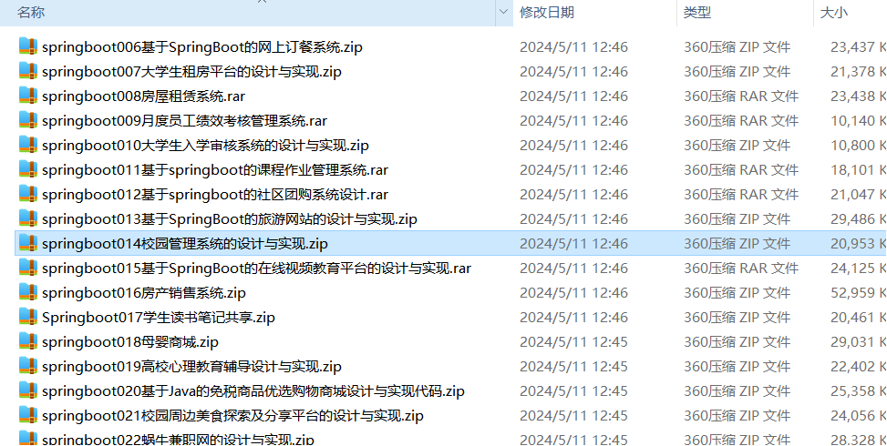
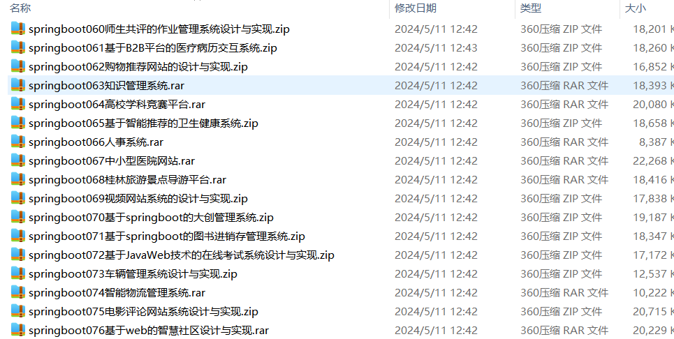

# springboot_admissions_rent_rental_orderfood_employee_exam
📦 **SpringBoot多功能项目仓库** 🎯

本仓库汇集了五个基于 **SpringBoot** 的高实用性项目，适用于学习、开发实践和功能拓展！🚀

📝 **大学生入学审核系统** —— 身份验证、证件上传、审核流程管理，助力高校新生入学审批 🎓✅

🏠 **大学生租房系统** —— 房源管理、预约看房、在线沟通、合同签订，为大学生提供便捷租房服务 🏡📄

🏢 **房屋租赁系统** —— 房东房源发布、租客筛选、在线支付、合同管理，打造高效的租赁管理平台 💼🏠

🍽️ **网上订餐系统** —— 商家入驻、菜单管理、在线点餐、订单支付、配送跟踪，提升外卖订餐体验 🍕🚀

📊 **月度员工绩效考核系统** —— 绩效评分、数据统计、考核报表、部门对比，助力企业人力资源优化 📈👨‍💼

项目部署说明✨：

推荐使用：谷歌浏览器

后台地址😎
http://localhost:8080/springboot/admin/dist/index.html

管理员  abo 密码 abo

前台地址😎

http://localhost:8080/springboot/front/index.html

在src\main\resources\application.yml中编辑数据库配置🎉										
url: jdbc:mysql://127.0.0.1:3306/springboot?useUnicode=true&characterEncoding=utf-8&useJDBCCompliantTimezoneShift=true&useLegacyDatetimeCode=false&serverTimezone=UTC
username: root
password: 123456

文档预览👀

其他项目合集✨

